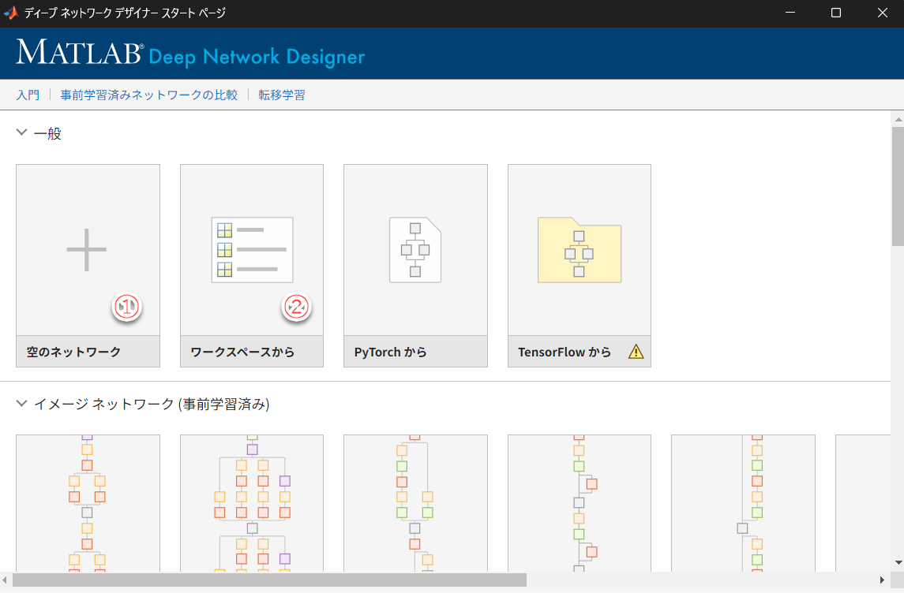
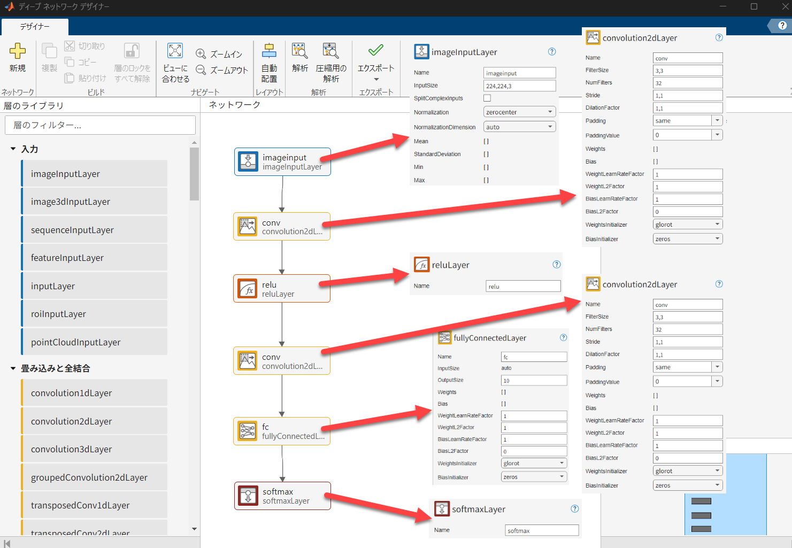
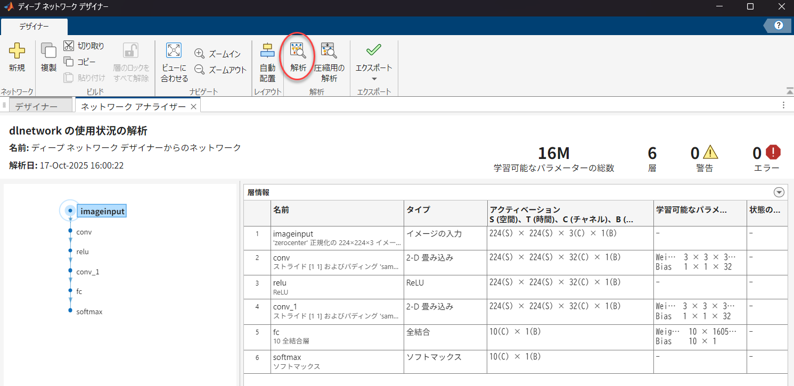
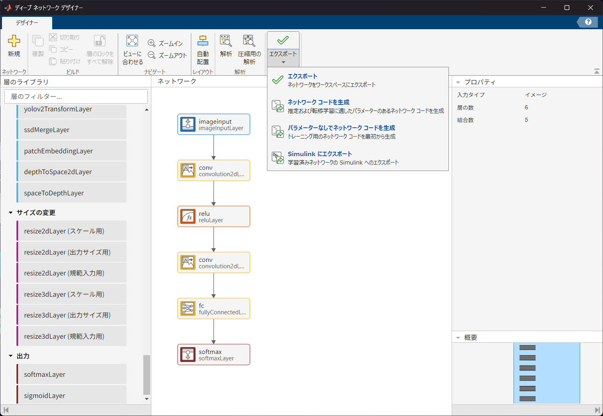

## ディープネットワークデザイナーを用いてスクラッチからモデルを作成する

Deep Learning Toolbox™には、ディープニューラルネットワークの層を作成し相互結合するためのシンプルなMATLABコマンドが用意されていますが、Deep Network Designerアプリを使用すると、これらの操作を対話形式で行うことができます。

### Deep Network Designerの起動

Deep Network Designerを起動するには、以下のいずれかの方法を使用します。

1. [アプリ] タブから起動する：MATLAB®の**[アプリ]** タブにある [機械学習および深層学習] セクションで、Deep Network Designerのアイコンをクリックします。

2. コマンドラインから起動する：MATLABコマンドラインで以下のコマンドを実行します。
   ```matlab
    >> deepNetworkDesigner
   ```

### スクラッチからのネットワーク構築手順

新規にゼロから学習させるネットワークを作成する場合は、以下の手順でネットワーク構造を定義します。  
下図のようにスタートページが現れますので、①にある空のネットワークをクリックします。(②はワークスペース上にあるレイヤーやネットワークオブジェクト変数をロードすることができます。)  各種学習済ネットワーク用のサポートパッケージをインストールしている場合、ワークスペースを介さず、直接インポートすることも可能です。  



※ Deep Network Designerは、R2024a以降、デフォルトで dlnetwork オブジェクトを作成しようとします。dlnetwork オブジェクトは、幅広いネットワークアーキテクチャ（多入力、多出力など）に対応する推奨される統一データ型です。

#### 層の追加と接続
構築するタスク（例：イメージ分類、シーケンス分類、回帰）に合わせて、必要な層を [層のライブラリ] からドラッグ＆ドロップし、層の間をワイヤーで接続していきます。  
イメージ分類用の基本的な深層学習ネットワークを作成する場合、通常、以下のような層群を順番に配置します。



それぞれの層には層の名前や独自のパラメータなどを指定することができます。  

また、以下図の赤丸で囲った[解析]をクリックすると、ネットワークの接続等に問題がないか解析することができます。問題がある場合は、エラーメッセージを出力します。  
また、各層の**アクティベーションサイズ**や**学習可能なパラメータ**の行列の次元サイズなどを確認することができます。



### ネットワークのエクスポート

ディープネットワークデザイナーには、下図に示すように主に4つのエクスポートオプションがあります。



#### ネットワークをワークスペースに保存/エクスポート

作業中のネットワークをワークスペースに直接 dlnetwork としてエクスポートすることができます。

*   **詳細:** ネットワークの解析が完了し、学習の準備が整った後、「エクスポート」をクリックすることで、アプリはネットワークをワークスペース内の変数（例: `net_1`）に保存します。
*   **用途:** 構築または編集したネットワークをMATLABのコマンドライン環境ですぐに使用したい場合に便利です。


#### ネットワーク コードを生成 

このオプションを選択すると、ネットワーク内の層を**初期パラメーター（重みとバイアス）を含めて**再作成するMATLABライブスクリプトが生成されます。

*   **詳細:** 生成されたスクリプトを実行すると、ネットワークアーキテクチャが `dlnetwork` オブジェクトとして返されます。同時に、初期パラメーター（重みとバイアス）を含むMATファイルも作成されます。
*   **用途:** 転移学習などのワークフローで、事前学習済みの重みを保持したい場合にこのオプションが役立ちます。

#### パラメーターなしでネットワーク コードを生成

このオプションを選択すると、ネットワーク内の層のみを再作成するMATLABコードが生成されます。

*   **詳細:** 生成されるネットワークには、事前学習済みの重みなどの初期パラメーターは含まれません。
*   **用途:** ネットワークアーキテクチャのみを再利用したい場合に使用されます。

#### Simulink ブロックへエクスポート

Deep Network Designerアプリを使用して、ディープニューラルネットワークをSimulink®用の **単一ネットワークブロック** および**複数の層ブロック**としてエクスポートできます。

*   ネットワーク内の層に対応するブロックやサブシステムを含むSimulinkモデルを返します。
*   複数の層ブロックは、すべての層に対応している訳ではありません。対応する層のリストは[こちら](https://jp.mathworks.com/help/deeplearning/ug/list-of-deep-learning-layer-blocks.html)より確認できます。


