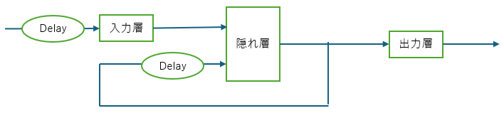

Deep Learning Toolbox™ で提供される浅層ニューラルネットワークのうち、時系列ネットワークとして分類される `timedelaynet`、`layrecnet`、および `narxnet` について、以下に詳細な解説とまとめの表を作成します。

これらのネットワークは、深層学習（ディープラーニング）モデル（CNNやLSTMなど）とは異なり、主に浅層ニューラルネットワークの領域で時系列問題の解決に使用される**動的ニューラルネットワーク**です。これらのネットワークは、R2012bで導入された Neural Time Series Tool (`ntstool`) など、時系列問題を解くためのツールで利用可能でした。

### 1. timedelaynet (時間遅延ニューラルネットワーク: TDNN)

#### アーキテクチャの特徴
`timedelaynet` は、入力に**タップ遅延線** (tap delay lines) を使用する動的ニューラルネットワークです。この遅延線は、ネットワークの重みの前に配置されます。
`timedelaynet` 関数は、入力遅延の範囲を指定してネットワークを作成します (`net = timedelaynet(inputDelays, hiddenSizes, trainingFcn)`)。
時系列データにおける**過去の値**を入力として考慮に入れる構造を持っています。このタイプのネットワークは、集中型 (focused) および分散型 (distributed) の両方の時間遅延ニューラルネットワークをサポートします。


#### 用途
`timedelaynet` は、時系列問題の解決に使用されます。過去の入力値が現在の予測に影響を与えるような、一般的な時系列予測や分類タスクに適しています。

### 2. narxnet (非線形自己回帰ネットワークと外部入力: NARX)

#### アーキテクチャの特徴
`narxnet` は、**フィードバック**を持つ動的ニューラルネットワークです。このネットワークは、「ニューラル自己回帰と外部入力」(Neural Auto-Regressive with External Input) を意味し、`narxnet(1:2, 1:2, 10)` のように、入力遅延とフィードバック遅延、隠れ層のサイズを指定して作成されます。

NARXネットワークの重要な特徴は、**開ループモード (open-loop)** と**閉ループモード (closed-loop)** の間で変換できることです。

*   **開ループ (シリーズ・パラレル) モード:** 予測誤差を最小化するために、外部ターゲット値がフィードバックとして使用されます。主に学習（トレーニング）に使用されます。
*   **閉ループ (パラレル) モード:** 外部フィードバックがない場合に、ネットワーク自身の出力が内部的にフィードバックとして使用されます。これにより、複数ステップ先の予測（多段予測）を行うことができます。


#### 用途
時系列問題、特に外部入力がある場合の時系列予測（例：システムのモデリングや予測）に非常に有用です。閉ループモードに変換することで、外部入力なしで連続的に将来の値を予測することが可能になります。

### 3. layrecnet (層再帰型ネットワーク: LRN)

#### アーキテクチャの特徴
`layrecnet` は、再帰的な接続を持つ動的ニューラルネットワークです。これは、層再帰型ネットワーク (Layer Recurrent Network: LRN) を作成するために使用されました。



#### 用途
`layrecnet` は、フィルタリングやモデリングのアプリケーションにおいて、より難しい問題の解決に役立つとされています。

---

### 使い分けと比較

これらの浅層時系列ネットワーク（動的ニューラルネットワーク）は、過去の情報の取り込み方が異なります。

| ネットワーク | 過去情報の取り込み方 | 主な機能/特徴 | 使い分けのポイント |
| :--- | :--- | :--- | :--- |
| **timedelaynet (TDNN)** | **入力の過去値**を遅延線で利用。 | 基本的な時系列予測/分類。構造が比較的単純。 | 予測が**外部入力**の過去の履歴のみに依存する場合。最もシンプルな時系列モデルが必要な場合。 |
| **layrecnet (LRN)** | **層間の再帰**を利用。 | フィルタリング、より複雑なモデリング。 | 信号処理や、より高度な動的システムの表現が必要な場合。 |
| **narxnet (NARX)** | **入力の過去値**と**出力のフィードバック**の遅延を利用。 | 開ループ/閉ループの切り替え。多段予測が可能。 | 外部入力があり、かつ**多段階の予測**（閉ループ予測）が必要な場合に最適。システムのモデリングに特に強力。 |

これら 3 つのネットワークは、R2012bで導入された Neural Time Series Tool (`ntstool`) において、時系列問題解決のためのニューラルネットワークの選択肢として提供されていました。

---

### サンプルコード

このコードは、伝統的な動的ネットワークである **NARX (Nonlinear Autoregressive with eXternal input) ネットワーク** を利用して、時系列データの後続の値を予測する基本的なワークフローを示しています。特に、学習時には**開ループ モード**でネットワークを訓練し、予測時には**閉ループ モード**に切り替えることで、自己回帰的な多段階予測を実現しています。  

```matlab
% Seed 固定 (再現性確保のため)
rng(21)

% 入出力データ作成
% 80サンプル分を学習データとし
% 20サンプル分を予測データとする
[X,T] = simpleseries_dataset;
Xnew = X(81:100); % 未来用データ
Tnew =T(81:100); % 未来用データ
X = X(1:80); % 学習用データ
T = T(1:80); % 学習用データ

% NARX Network の作成
net = narxnet(0:2,1:2,11); % 入力遅延を 0 ～2/ 出力遅延を 1～ 2 サンプルとする
[Xs,Xi,Ai,Ts] = preparets(net,X,{},T); % 時系列ネットワークへ入力するためにデータを準備
net = train(net,Xs,Ts,Xi,Ai); % 学習

% 予測処理の前準備
netc = closeloop(net); % ネットワークの閉ループ化

[Xs,Xi,Ai,Ts] = preparets(netc, X(end-2:end), {}, T(end-2:end) );
%[Xs,Xi,Ai,Ts] = preparets(netc, X(end-2:end), {}, con2seq(zeros(1,3)) ); % Feedback Delay の状態を0

% 予測処理 (test)
y2 = netc(Xnew, Xi, Ai);
y2 = seq2con(y2);
y2 = y2{1};

% 結果確認 およびグラフ化
Tnew = seq2con(Tnew);
Tnew = Tnew{1};
T = seq2con(T);
T = T{1};

figure
plot(1:100,[T,Tnew],'b-o',1:100,[T,y2],'r--*')
legend({'Reference';'Simulation (From 81 - 100)'})
grid on
```


**解説:**  
`narxnet` 関数を使用して NARX ネットワークを作成しています。
*   **`0:2` (入力遅延):** 外部入力 $x(t)$ の遅延ステップが 0、1、2 タイムステップ分、すなわち $x(t)$, $x(t-1)$, $x(t-2)$ が入力として使用されることを意味します。
*   **`1:2` (フィードバック遅延/出力遅延):** ネットワークの過去の出力（ターゲット $t$）の遅延ステップが 1、2 タイムステップ分、すなわち $t(t-1)$, $t(t-2)$ がフィードバックとして使用されることを意味します。
*   **`11`:** 隠れ層のニューロンの数が 11 個であることを指定しています。

NARX ネットワークは、デフォルトで**開ループ モード** (Open-loop mode) で作成されます。開ループ モードでは、学習時、ネットワークの出力フィードバックとして**真のターゲット値** $T$ が使用されます。これは、学習を安定させ、高速化するために一般的に推奨される方法です。  

`preparets` 関数は、時系列ネットワークの学習のためにデータを整形する重要な機能です。
*   NARX ネットワークは、指定された入力遅延（0～2）とフィードバック遅延（1～2）を満たすために、入力 $X$ とターゲット $T$ を適切にシフトする必要があります。
*   `preparets` は、必要な初期状態 (`Xi`, `Ai`) と、実際の学習に使用されるシーケンス データ (`Xs`, `Ts`) を準備します。ここで、`Xi` は**初期入力状態**を、`Ai` は**初期層状態**（フィードバック遅延）を格納します。

`closeloop` 関数は、学習済みの開ループ ネットワーク (`net`) を**閉ループ ネットワーク** (`netc`) に変換します。
*   **閉ループ モード (Closed-loop mode):** このモードでは、予測時に**ネットワーク自身の過去の予測出力**が、次の予測のためのフィードバック入力として再利用されます。
*   これにより、真のターゲット値が未知である学習後の未来のタイム ステップについて、モデルは**多段階予測（マルチタイムステップ予測**を実行できます。


