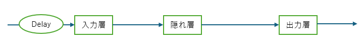
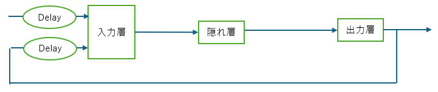
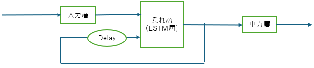
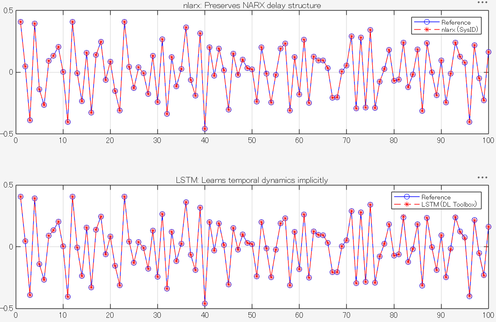

MATLAB®で提供される浅層ニューラルネットワークのうち、時系列ネットワークに分類されるいくつかのネットワークを紹介します。

これらのネットワークは、深層学習（ディープラーニング）モデルとは異なる、主に浅層ニューラルネットワークの領域で時系列問題の解決に使用される**動的ニューラルネットワーク**です。

### 1. 時間遅延ニューラルネットワーク

#### アーキテクチャの特徴
時間遅延ニューラルネットワークは、入力にタップ遅延線(tap delay lines) を使用する動的ニューラルネットワークです。この遅延線は、ネットワークの重みの前段に配置されます。時系列データにおける過去の値を入力として考慮に入れる構造を持っています。



#### 用途
過去の入力値が現在の予測に影響を与えるような、一般的な時系列予測や分類タスクに適しています。

### 2. 非線形自己回帰ネットワーク

#### アーキテクチャの特徴
非線形自己回帰ネットワークは、**フィードバック**を持つ動的ニューラルネットワークです。このネットワークは、System Identification Toolbox™で提供される `nlarx`関数を用い、`nlarx(data_train, [2 3 0], idSigmoidNetwork(11))` のように、入力遅延とフィードバック遅延、隠れ層のサイズを指定したシグモイド型のニューラルネットを指定して作成されます。



#### 用途
過去の入力値および過去の出力値が現在の予測に影響を与えるような、一般的な時系列予測や分類タスクに適しています。

### 3. 長・短期記憶ネットワーク(Long Short-Term Memory: LSTM)

#### アーキテクチャの特徴
LSTMは、再帰型ニューラルネットワーク（RNN）の一種であり、時系列データやシーケンスデータのタイムステップ間における**長期的な依存関係**を学習できるように設計されています.長いシーケンスデータに対しても効果的に情報を保持、伝播できます。



#### 用途
現在の入力値に加えて、過去の時間ステップから引き継がれた内部状態（隠れ状態）が現在の出力の予測に影響を与えるような、時系列予測や分類タスクに適しています。

---

### 使い分けと比較

これらの時系列ネットワーク（動的ニューラルネットワーク）は、過去の情報の取り込み方が異なります。

| ネットワーク | 過去情報の取り込み方 | 主な機能/特徴 | 使い分けのポイント |
| :--- | :--- | :--- | :--- |
| **時間遅延ニューラルネットワーク** | **入力の過去値**を遅延線で利用 | 基本的な時系列予測/分類。構造が比較的単純 | 予測が**外部入力**の過去の履歴のみに依存する場合。最もシンプルな時系列モデルが必要な場合 |
| **非線形自己回帰ネットワーク** | **入力の過去値**と**出力のフィードバック**の遅延を利用 | フィルタリング、より複雑なモデリング | より高度な動的システムの表現が必要な場合 |
| **LSTM** | **入力の現在値**と**過去の時間ステップから引き継がれた内部状態**を利用 | 長期的な依存関係や可変長シーケンスを学習できるリカレント型 | シーケンス長が長いデータ、過去の文脈・依存関係が重要なタスク(音声、テキストなど)に向いている |


---

### サンプルコード

このコードは、時系列ネットワークである **非線形自己回帰ニューラルネットワーク** と **長・短期記憶(LSTM)ネットワーク**を利用して、時系列データの後続の値を予測する基本的なワークフローを示しています。  

```matlab
%% 1. データ準備
rng(21)

% 入出力データ作成
% 80サンプル分を学習データとし
% 20サンプル分を予測データとする
[X,T] = simpleseries_dataset;
XData = cell2mat(X); % 1 x 100
TData = cell2mat(T); % 1 x 100

XTrain = XData(1:80); % 学習用入力データ
TTrain = TData(1:80); % 学習用教師データ
XTest = XData(81:100); % 予測用の入力データ
TTest = TData(81:100); % 予測用の正解出力データ

%% 2. 非線形自己回帰ニューラルネットワーク(nlarx)
data_train = iddata(TTrain', XTrain', 1);

sys = nlarx(data_train, [2 3 0], idSigmoidNetwork(11));

% Closed-loop prediction using forecast
future_input = iddata([], XTest', 1);
yForecast = forecast(sys, data_train, 20, future_input);
y_nlarx = yForecast.OutputData';

mse_nlarx = mean((TTest - y_nlarx).^2);
fprintf('=== NARX Time Series Results ===\n');
fprintf('nlarx prediction MSE: %.6f\n', mse_nlarx);

%% 3. 長・短期記憶(LSTM)ネットワーク

layers = [
    sequenceInputLayer(2)          % [exogenous input; feedback]
    lstmLayer(11)                  % Match original 11 hidden neurons
    fullyConnectedLayer(1)
];
net = dlnetwork(layers);

% Prepare training data: T x C format (time steps x channels)
feedback_train = [0, TTrain(1:end-1)];
XTrainSeq = [XTrain; feedback_train]';  % 80 x 2

options = trainingOptions("adam", ...
    MaxEpochs=500, ...
    MiniBatchSize=1, ...
    InitialLearnRate=0.005, ...
    GradientThreshold=1, ...
    Verbose=false, ...
    Plots="none");

net = trainnet(XTrainSeq, TTrain', net, "mse", options);

% Closed-loop prediction: warm up state then predict iteratively
net = resetState(net);
XWarmup = [XTrain; feedback_train]';
[~, state] = predict(net, XWarmup);
net.State = state;

y_lstm = zeros(1, 20);
prevTarget = TTrain(end);
for i = 1:20
    inputStep = [XTest(i); prevTarget]';
    [YPred, state] = predict(net, inputStep);
    net.State = state;
    y_lstm(i) = YPred;
    prevTarget = y_lstm(i);
end

mse_lstm = mean((TTest - y_lstm).^2);
fprintf('LSTM prediction MSE:  %.6f\n', mse_lstm);

%% 4. 結果比較
fprintf('\n--- Comparison ---\n');
fprintf('nlarx MSE: %.6f (explicit NARX structure, numerically closest to legacy)\n', mse_nlarx);
fprintf('LSTM MSE:  %.6f (learned dynamics, different architecture)\n', mse_lstm);

figure;
tiledlayout(2,1);
nexttile;
plot(1:100, [TTrain, TTest], 'b-o', 1:100, [TTrain, y_nlarx], 'r--*');
legend('Reference', 'nlarx (SysID)');
title('nlarx: Preserves NARX delay structure');
grid on;

nexttile;
plot(1:100, [TTrain, TTest], 'b-o', 1:100, [TTrain, y_lstm], 'r--*');
legend('Reference', 'LSTM (DL Toolbox)');
title('LSTM: Learns temporal dynamics implicitly');
grid on;


```




### 解説
#### 非線形自己回帰ニューラルネットワーク
`nlarx` 関数を使用して 非線形自己回帰ニューラルネットワークを作成しています。
*   **`na = 2` (出力遅延):** ** 外部入力 $x(t)$ の遅延ステップが 0、1、2 タイムステップ分、すなわち $x(t)$, $x(t-1)$, $x(t-2)$ が入力として使用されることを意味します。
*   **`nb = 3` (入力遅延):** ネットワークの過去の出力（ターゲット $t$）の遅延ステップが 1、2 タイムステップ分、すなわち $t(t-1)$, $t(t-2)$ がフィードバックとして使用されることを意味します。
*   **`idSigmoidNetwork(11)`** 隠れ層のニューロンの数が 11 個であることを指定しています。

`forecast` 関数を使用して、学習済みモデル sys と過去の学習データをもとに、未来の20ステップ分を予測します

#### 長・短期記憶(LSTM)ネットワーク
* **ネットワーク構造の定義**:
  * **`sequenceInputLayer(2)`**: 外部入力 $x(t)$ と1ステップ過去のターゲット値 $y(t-1)$ の2つのチャネルを受け取る入力層です。
  * **`lstmLayer(11)`**: `nlarx` の条件に合わせて11個の隠れユニットを持つLSTM層です。時系列データ内の長期的な依存関係を記憶・学習します。
  * **`fullyConnectedLayer(1)`**: 予測値を1次元の数値として出力する全結合層です。
  * **`dlnetwork`**: 定義した層配列から、ネットワークオブジェクトを作成します。
* **学習データの準備と学習**:
  * **`feedback_train`**: 学習用ターゲット `TTrain` を1ステップずらし、遅延フィードバック列（2番目のチャネル）を作成します。
  * **`trainnet(...)`**: 平均二乗誤差損失（`"mse"`）を指定して、ネットワークの学習を実行します。
* **状態の初期化**:
  * **`resetState(net)`**: LSTMの内部状態（セル状態・隠れ状態）を初期化します。
  * **`predict(net, XWarmup)`**: 学習用系列をネットワークに通してLSTMの内部状態を更新し、過去の文脈情報を引き継ぎます (`net.State = state`)。
* **逐次閉ループ予測ループ (`for i = 1:20`)**:
  * 各タイムステップにおいて、現在の外部入力 `XTest(i)` と、前のステップで予測した値 `prevTarget` を結合して入力します。
  * **`predict(net, inputStep)`** により1ステップ予測し、同時に内部状態（`net.State`）を更新しながら、予測値を次の入力へと引き継ぐことで自律的な閉ループ予測を実現しています。


