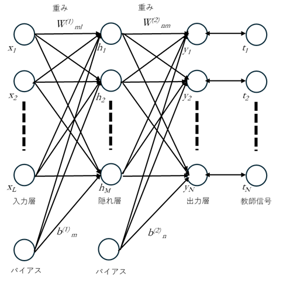

 浅層ネットワークは、提供される古典的なニューラルネットワークであり、MATLAB®では 2016年以前から提供されます。ネットワークの初期定義や、入力/教師データの定義方法などは、現在の深層学習型とは異なりますが、深層学習を始める前に、浅層ネットワークを使ってニューラルネットワークを理解してみます。

浅層ニューラルネットワーク、特に3層のネットワークについて、その仕組み、順伝播ステップ、逆伝播ステップ、および関連するMATLABの`fitnet`関数、`patternnet`関数を用いたコード例について解説します。

---

### 浅層ニューラルネットワークの概要

深層学習ネットワークが使用されるからある、全結合層のみから構成される古典的なニューラルネットワークで、通常、少数の層で構成されます。これらのネットワークは、パターン認識や回帰などの様々なタスクに使用されます。




基本的な浅層ニューラルネットワークは、以下の要素で構成される多層構造を持っています:
*   **入力層**: ネットワークにデータが供給される層です。
*   **隠れ層**: 入力層と出力層の間に位置し、元の入力の非線形結合を計算します。「中間層」や「特徴抽出層」とも呼ばれ、次の層への入力となります。
*   **出力層**: ネットワークの最終的な予測を出力する層です。

### 3層ニューラルネットワークの順伝播ステップと逆伝播ステップ

ここで説明する 3層ネットワークは、**入力層**、**1つの隠れ層**、**出力層**で構成されるネットワークを指します。
ニューラルネットワークの学習には、順伝播ステップと逆伝播ステップの2ステップで構成されます。順伝播ステップは入力データから出力値を求める過程、逆伝播ステップでは、ネットワーク出力値と教師値の誤差を最小化するために、ネットワークのパラメータ(重み、バイアス)を出力層から入力層に遡って更新する過程とまずは最低限覚えていただくことで問題ありません。以下に2種類のステップの仕組みとフローについて詳細を説明しますが、興味があればご参照ください。

#### 1. 順伝播 (Forward Propagation) ステップ

順伝播は、入力データがネットワークを通じて前方に伝播し、最終的な出力が計算されるプロセスです。

**仕組みとフロー:**
1.  **入力層から隠れ層へ:**
    *   入力データ $x$ が入力層に与えられます。
    *   各入力ニューロン $i$ から隠れ層の各ニューロン $j$ へと、重み $w_{ji}^{(1)}$ を介して信号が伝達されます。
    *   隠れ層の各ニューロン $j$ では、これらの重み付き入力の合計にバイアス $b_j^{(1)}$ が加算され、総入力 $a_j^{(1)}$ が計算されます。
    *   この総入力 $a_j^{(1)}$ は、活性化関数 $f$ (例: シグモイド関数) を通じて非線形変換され、隠れ層の出力 $h_j$（活性化）となります。

2.  **隠れ層から出力層へ:**
    *   隠れ層の出力 $h$ が、出力層への入力となります。
    *   各隠れニューロン $j$ から出力層の各ニューロン $k$ へと、重み $w_{kj}^{(2)}$ を介して信号が伝達されます。
    *   出力層の各ニューロン $k$ では、これらの重み付き入力の合計にバイアス $b_k^{(2)}$ が加算され、総入力 $a_k^{(2)}$ が計算されます。
    *   この総入力 $a_k^{(2)}$ は、出力層の活性化関数 $g$ (例: 線形関数、シグモイド関数、ソフトマックス関数等 ) を通じて非線形変換され、ネットワークの最終出力 $y_k$ となります。

**数式 :**
*   **隠れ層の総入力 $a_j^{(1)}$:**
    $a_j^{(1)} = \sum_{i=1}^{N_{in}} w_{ji}^{(1)} x_i + b_j^{(1)}$
    ここで、 $N_{in}$  は入力の数、 $w_{ji}^{(1)}$  は入力層のニューロン  $i$  から隠れ層のニューロン  $j$  への重み、 $x_i$  は入力、 $b_j^{(1)}$  は隠れ層のニューロン  $j$  のバイアスです。
*   **隠れ層の活性化 $h_j$:**
    $h_j = f(a_j^{(1)})$
    ここで、 $f$  は隠れ層の活性化関数です。
*   **出力層の総入力 $a_k^{(2)}$:**
    $a_k^{(2)} = \sum_{j=1}^{N_{hidden}} w_{kj}^{(2)} h_j + b_k^{(2)}$
    ここで、 $N_{hidden}$  は隠れ層のニューロン数、 $w_{kj}^{(2)}$  は隠れ層のニューロン  $j$  から出力層のニューロン  $k$  への重み、 $h_j$  は隠れ層の活性化、 $b_k^{(2)}$  は出力層のニューロン  $k$  のバイアスです。
*   **出力層の最終出力 $y_k$:**
    $y_k = g(a_k^{(2)})$
    ここで、 $g$  は出力層の活性化関数です。

#### 2. 逆伝播 (Backpropagation) ステップ

逆伝播は、ネットワークの出力と真のターゲットとの間の誤差を計算し、その誤差をネットワークの重みとバイアスに逆方向に伝播させて、これらのパラメータを調整するプロセスです。これにより、ネットワークは学習目標に近づくように最適化されます。

**仕組みとフロー:**
1.  **出力層の誤差計算:**
    *   順伝播で得られたネットワークの出力  $y$  と、実際のターゲット  $t$  との間に損失（誤差）が計算されます。
    *   この損失関数（例: 回帰の場合は平均二乗誤差、分類の場合は交差エントロピー損失）の勾配を、出力層の各ニューロンについて計算します。これは、ネットワークの出力に対する各ニューロンの総入力の勾配と、損失に対する出力の勾配の積として計算されます。

2.  **隠れ層への誤差伝播:**
    *   出力層で計算された誤差（勾配）は、重みを介して隠れ層へと逆方向に伝播されます。
    *   隠れ層の各ニューロンについて、出力層から伝播された誤差と、そのニューロンの活性化関数の勾配を考慮して、誤差（勾配）が計算されます。

3.  **重みとバイアスの更新:**
    *   各層の重みとバイアスは、それぞれの層で計算された勾配（誤差の伝播によって得られる）と、学習率（`trainingOptions`で指定可能）に基づいて更新されます。
    *   この更新により、次の順伝播では、誤差が減少するようにネットワークの予測が改善されます。この調整は、`dlgradient`のような関数によって自動的に実行される自動微分を活用して行われます。

**数式 (この数式は提供されたソースには直接記載されておらず、一般的なニューラルネットワークの知識に基づいています):**
*   **損失関数に対する出力層の勾配 $\delta_k^{(2)}$:**
    $\delta_k^{(2)} = (y_k - t_k) \cdot g'(a_k^{(2)})$
    ここで、 $t_k$  はターゲット値、 $g'$  は出力層の活性化関数  $g$  の導関数です。
*   **隠れ層の勾配 $\delta_j^{(1)}$:**
    $\delta_j^{(1)} = ( \sum_{k=1}^{N_{out}} w_{kj}^{(2)} \delta_k^{(2)}) \cdot f'(a_j^{(1)})$
    ここで、 $N_{out}$  は出力の数、 $f'$  は隠れ層の活性化関数  $f$  の導関数です。
*   **出力層の重み更新 $\Delta w_{kj}^{(2)}$:**
    $\Delta w_{kj}^{(2)} = -\eta \cdot \delta_k^{(2)} h_j$
    ここで、 $\eta$ は学習率です。
*   **出力層のバイアス更新 $\Delta b_k^{(2)}$:**
    $\Delta b_k^{(2)} = -\eta \cdot \delta_k^{(2)}$
*   **隠れ層の重み更新 $\Delta w_{ji}^{(1)}$:**
    $\Delta w_{ji}^{(1)} = -\eta \cdot \delta_j^{(1)} x_i$
*   **隠れ層のバイアス更新 $\Delta b_j^{(1)}$:**
    $\Delta b_j^{(1)} = -\eta \cdot \delta_j^{(1)}$
    これらの更新は、通常、勾配降下法などの最適化アルゴリズム（例: SGDm, Adam, RMSprop）を使用して行われます。

---

### `fitnet`関数を用いた3入力2出力の回帰ネットワークの学習と推論のコード例

`fitnet`関数は、指定された入力とターゲットに基づいて浅層回帰ネットワークを作成します。この関数は、データの前処理、データ分割、後処理を自動化するため、簡単にネットワークを構築・学習できます。

ここでは、3つの入力特徴から2つの出力値を予測するネットワークの例を示します。隠れ層のニューロン数は、一例として10個とします。

```matlab
% 1. 学習データの準備
% 例として、ランダムなデータを生成します。
% 実際のアプリケーションでは、ここに実際のデータを読み込みます。
numSamples = 100;  % サンプル数
numInputs = 3;     % 入力数
numOutputs = 2;    % 出力数

% 3入力のデータ (例: 3x100の行列, 各列が1つの観測値)
% MATLABの浅層ネットワーク関数は通常、入力を行列として、行が特徴、列が観測値として扱います。
P = rand(numInputs, numSamples); % 入力データ (3特徴 x 100サンプル)

% 2出力のターゲットデータ (例: 2x100の行列)
T = rand(numOutputs, numSamples) * 10; % ターゲットデータ (2出力 x 100サンプル)

% 2. ネットワークの作成
% fitnet関数を使用して、10個のニューロンを持つ隠れ層が1つあるフィードフォワードネットワークを作成します。
% net = fitnet(hiddenSizes)
% hiddenSizesは隠れ層のニューロン数を指定する行ベクトルです。
hiddenLayerSize = 10;
net = fitnet(hiddenLayerSize);

% ネットワークの表示 (オプション)
% view(net);

% 3. ネットワークの学習
% train関数を使用してネットワークに学習させます。
% fitnetはデフォルトでデータの分割（学習、検証、テスト）を自動的に行います。
% trainnet関数と異なり、浅層ネットワークの学習はtrain関数を使用します。
[net, tr] = train(net, P, T);

% 学習後のパフォーマンスの確認 (オプション)
% plotperform(tr)

% 4. 推論（予測）
% 学習済みネットワークを使用して新しい入力データに対する予測を行います。
% 新しいデータは、学習データと同じ形式（3特徴 x 新しいサンプル数）である必要があります。
numNewSamples = 5;
P_new = rand(numInputs, numNewSamples); % 新しい入力データ

% net()またはsim()関数で予測を実行します。
Y_pred = net(P_new);

fprintf('新しい入力データに対する予測結果:\n');
disp(Y_pred);
```

**コードの説明**

*   **`fitnet の概要`の概要**: `fitnet`は、主に関数近似(Fitting)または回帰(Regression)タスクに使用されるフィードフォワードニューラルネットワークを作成する為に設計されています。これは`feedforwardnet`と実質的に同じであり、回帰タスクで使用されます。
*   **ネットワーク構造**:
    *   **入力層 (Input Layer)**: この例では、`P = rand(numInputs, numSamples); `として3つの特徴量を持つデータを用意しているため、入力層のユニット数は自動的に3になります。
    *   **隠れ層 (Hidden Layer)**: `net = fitnet(hiddenLayerSize);`と指定することで、隠れ層が1層で10ユニットのネットワークが構築されます。シャローニューラルネットワークは、比較的に浅い（層の数が少ない）隠れ層で構成されます。
    *   **出力層 (Output Layer)**: `fitnet`は回帰用に設計されており、ターゲットデータ`T`の次元（この場合は2）に基づいて出力層のユニット数を自動的に設定します
*   **データ形式**:
    *   **入力データ `P`**: `input × pattern`、つまり「特徴量数 × サンプル数」の行列として準備します。ここでは `3 × 100` の行列です。
    *   **ターゲットデータ `T`**: `output × pattern`、つまり「出力数 × サンプル数」の行列として準備します。
*   **学習プロセス**:
    *   `train(net, P, T)`関数によってネットワークが学習されます。学習時には、指定された学習データがデフォルトで学習（70%）、検証（15%）、テスト（15%）の3つのセットに自動的に分割されます。
    *   学習の目的は、誤差`E = (o1 - t1)^2 / 2`を最小化することです。これは、重みを`v1(n+1) = v1(n) - η ∂E/∂v1`のように更新することで行われます（勾配降下法の概念）。
*   **結果の評価**:
    コードの実行と関連するコメントは、主に学習後のネットワークの利用（推論）と、パフォーマンスの監視方法に焦点を当てています。

    1.  **推論（予測）**:
       *   学習済みネットワークを使用して、新しい入力データ `P_new` に対する予測が行われます。
       *   予測は、**`net()`** 関数または **`sim()`** 関数を使用して実行できます。
       *   入力データ `P_new` は、学習データ `P` と同じ形式（特徴量 x サンプル数）である必要があります。
    2.  **学習パフォーマンスの確認（オプション）**:
       *   コードのオプション部分では、学習後のパフォーマンスを**`plotperform(tr)`**を使用して確認することが提案されています。`tr`は`train`関数から返される学習レコードを含む構造体です。
    3.  **一般的な評価**: 一般的な回帰タスクでは、性能は**平方根平均二乗誤差 (RMSE)** などを使用して評価されます。

---

`patternnet`関数を使用して、ご指定の要件（入力層3ユニット、隠れ層10ユニット、出力層4クラス分類）を満たす簡易的な分類モデルのサンプルコードを以下に示します。

### `patternnet` を用いた4クラス分類モデルのサンプルコード

```matlab
% 1. データの準備
% 入力データ (u): 3ユニット（特徴量）x サンプル数
% 例えば、100個のサンプルをランダムに生成します。
num_input_features = 3;
num_samples = 100;
u = rand(num_input_features, num_samples); % 3x100のランダム入力データ

% ターゲットデータ (t): 4クラス分類のため、4xサンプル数 のワンホットエンコーディング形式
% 各サンプルがどのクラスに属するかを示すラベルを生成し、それをワンホットエンコーディングに変換します。
num_classes = 4;
% 各サンプルがランダムに1から4のいずれかのクラスに属するとします。
% 例: [1 2 3 4 1 2 ...]
t_labels = randi([1, num_classes], 1, num_samples);

% クラスラベルをワンホットエンコーディングに変換します。
% ind2vec関数は、インデックスベクトルをワンホット行列に変換します。
t = full(ind2vec(t_labels, num_classes)); % 4x100のワンホットエンコードされたターゲットデータ

% 2. ニューラルネットワークの作成
% patternnet関数を使用して、指定された隠れ層のユニット数（10ユニット）を持つネットワークを作成します。
% patternnetは分類モデルに特化しており、出力層は自動的にターゲットデータの次元（この場合4クラス）と
% 分類に適した活性化関数（通常はSoftmax）に設定されます。
hidden_layer_size = 10;
net = patternnet(hidden_layer_size);

% 3. ネットワークの学習
% train関数を使用して、準備した入力データ (u) とターゲットデータ (t) でネットワークを学習させます。
% 学習プロセス中、データはデフォルトで学習 (70%)、検証 (15%)、テスト (15%) に分割されます。
disp('ネットワークの学習を開始します...');
net = train(net, u, t);
disp('ネットワークの学習が完了しました。');

% 4. 学習結果の確認 (オプション)
% 学習済みネットワークを使って、入力データに対する予測を行います。
y_predicted = net(u);

% 混同行列をプロットして分類性能を確認します。
% plotconfusion(t_original, y_predicted_outputs)
% t はワンホットエンコーディングなので、予測出力もワンホットエンコーディングと見なせる形式になります。
% 通常、plotconfusionはターゲットと出力が同じ形式（ワンホットまたはクラスインデックス）を期待します。
figure;
plotconfusion(t, y_predicted);
title('学習データの混同行列');

% 新しいデータに対する予測の例
disp('新しい入力データに対する予測:');
new_input = rand(num_input_features, 1); % 新しい1サンプルデータ (3ユニット)
new_output_onehot = net(new_input);

% ワンホットエンコーディングから予測クラスを抽出します。
[~, predicted_class_index] = max(new_output_onehot);
fprintf('新しい入力 [%.2f, %.2f, %.2f] に対する予測クラス: %d\n', ...
        new_input(1), new_input(2), new_input(3), predicted_class_index);

% ネットワークの構造と重み、バイアスを確認することも可能です。
% disp('ネットワークの重み (入力層-隠れ層):');
% disp(net.IW{1});
% disp('ネットワークのバイアス (隠れ層):');
% disp(net.b{1});
```

**コードの説明**

*   **`patternnet`の概要**: `patternnet`は、分類問題に特化したシャローニューラルネットワーク（Shallow Neural Network）を構築するためのMATLAB関数です。これは`feedforwardnet`と実質的に同じであり、分類タスクで使用されます。
*   **ネットワーク構造**:
    *   **入力層 (Input Layer)**: この例では、`u = rand(3, num_samples)`として3つの特徴量を持つデータを用意しているため、入力層のユニット数は自動的に3になります。
    *   **隠れ層 (Hidden Layer)**: `patternnet(10)`と指定することで、隠れ層が1層で10ユニットのネットワークが構築されます。シャローニューラルネットワークは、比較的に浅い（層の数が少ない）隠れ層で構成されます。
    *   **出力層 (Output Layer)**: `patternnet`は分類用に設計されており、ターゲットデータ`t`の次元（この場合は4クラス）に基づいて出力層のユニット数を自動的に設定します。分類の場合、出力は通常「ワンホット行列」の形式になります。
*   **データ形式**:
    *   **入力データ `u`**: `input × pattern`、つまり「特徴量数 × サンプル数」の行列として準備します。ここでは `3 × 100` の行列です。
    *   **ターゲットデータ `t`**: `output × pattern`、つまり「クラス数 × サンプル数」のワンホットエンコーディング行列として準備します。4クラス分類のため、各サンプルのラベルを`ind2vec`関数で`4 × 100`のワンホット行列に変換しています。
*   **学習プロセス**:
    *   `train(net, u, t)`関数によってネットワークが学習されます。学習時には、指定された学習データがデフォルトで学習（70%）、検証（15%）、テスト（15%）の3つのセットに自動的に分割されます。
    *   学習の目的は、誤差`E = (o1 - t1)^2 / 2`を最小化することです。これは、重みを`v1(n+1) = v1(n) – η ∂E/∂v1`のように更新することで行われます（勾配降下法の概念）。
*   **結果の評価**: `plotconfusion`関数を使用すると、モデルの分類性能を視覚的に確認するための混同行列を表示できます。これにより、各クラスがどれだけ正確に分類されたか、誤分類がどのように発生したかを把握できます。
